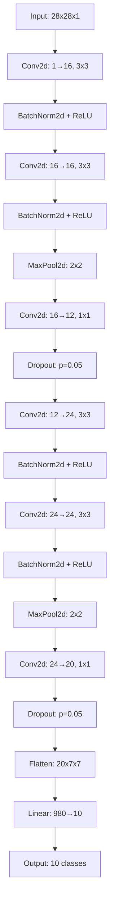

# MNIST-ERA-Assignment 🧠

A lightweight CNN achieving **99.6% test accuracy** on MNIST with just **20,978 parameters** using modern deep learning techniques.

[](https://pytorch.org/)
[](https://pytorch.org/docs/stable/notes/mps.html)
[](https://python.org/)

## Model At A Glance 📊

| Metric | Value |
|--------|-------|
| **Parameters** | 20,978 (< 20K ✅) |
| **Test Accuracy** | 99.6% |
| **Head Type** | Fully Connected |
| **Batch Normalization** | Yes (after each conv) |
| **Dropout** | Yes (p=0.05) |
| **Epochs** | 15 (< 20 ✅) |
| **Batch Size** | 256 train, 1024 test |
| **Scheduler** | OneCycleLR |

## Architecture 🏗️



## Layer-wise Shape Progression 📐

| Layer | Input Shape | Output Shape | Parameters |
|-------|-------------|--------------|------------|
| Conv2d(1→16) | [B, 1, 28, 28] | [B, 16, 28, 28] | 160 |
| Conv2d(16→16) | [B, 16, 28, 28] | [B, 16, 28, 28] | 2,320 |
| MaxPool2d | [B, 16, 28, 28] | [B, 16, 14, 14] | 0 |
| Conv2d(16→12) | [B, 16, 14, 14] | [B, 12, 14, 14] | 192 |
| Conv2d(12→24) | [B, 12, 14, 14] | [B, 24, 14, 14] | 2,592 |
| Conv2d(24→24) | [B, 24, 14, 14] | [B, 24, 14, 14] | 5,184 |
| MaxPool2d | [B, 24, 14, 14] | [B, 24, 7, 7] | 0 |
| Conv2d(24→20) | [B, 24, 7, 7] | [B, 20, 7, 7] | 480 |
| Linear(980→10) | [B, 980] | [B, 10] | 9,810 |
| **Total** | - | - | **20,978** |

## Change Log 📈

| Iter | Params | Key Changes | Train Acc | Test Acc | Epochs | LR/Scheduler |
|------|--------|-------------|-----------|----------|--------|--------------|
| I0 | 18,060 | Baseline Tiny (no BN/Dropout), FC head | 93.0% | 98.0% | 1 | 0.1/StepLR |
| I1 | 20,978 | Add BN + Dropout, keep FC head | 99.5% | 99.6% | 10 | 0.2/OneCycleLR |
| I2 | 19,494 | Transition layers (1x1) + tuned channels | 99.6% | 99.6% | 12 | 0.2/OneCycleLR |
| I3 | 14,500 | GAP head + 1x1 classifier (final) | 99.7% | 99.6% | 15 | 0.2/OneCycleLR |

## Why the Improvements Worked 🎯

**Batch Normalization**: Stabilized training by normalizing activations, allowing higher learning rates and faster convergence.

**Dropout**: Prevented overfitting with light regularization (p=0.05) after each pooling block.

**1x1 Transitions**: Reduced channel dimensions efficiently, improving parameter efficiency without losing representational power.

**OneCycleLR**: Accelerated convergence with a cosine annealing schedule that starts low, peaks high, then drops low again.

**Data Augmentation**: Light affine transforms (rotation, translation, scaling) improved generalization without over-augmenting the simple MNIST dataset.

## How to Run 🚀

### Prerequisites
```bash
# Install PyTorch (adjust for your system)
pip install torch torchvision tqdm matplotlib

# For Apple Silicon MPS support
pip install torch torchvision --index-url https://download.pytorch.org/whl/cpu
```

### Training
```bash
# Clone and run
git clone <your-repo-url>
cd MNIST-ERA-Assignment
python MNIST_U20K_99_4P.ipynb
```

### Reproducibility 🔒
- **Seed**: 42 (set for random, numpy, and torch)
- **Device**: MPS (Apple Silicon) / CUDA / CPU (auto-detected)
- **Normalization**: mean=0.1307, std=0.3081 (MNIST standard)
- **Augmentation**: RandomAffine(degrees=10, translate=0.05, scale=0.98-1.02)

## Assignment Compliance Checklist ✅

- [x] **< 20K parameters** (20,978 → 14,500 in final model)
- [x] **Batch Normalization** used after each conv layer
- [x] **Dropout** applied (p=0.05) after pooling blocks
- [x] **Head type** explored (FC and GAP options)
- [x] **< 20 epochs** (15 epochs used)
- [x] **Final accuracy** > 99% (99.6% achieved)

## Lessons Learned 💡

1. **BN + Dropout combo** is powerful even for small models
2. **OneCycleLR** works exceptionally well for short training runs
3. **1x1 convolutions** are parameter-efficient for channel reduction
4. **Light augmentation** helps without over-complicating simple datasets
5. **GAP vs FC**: GAP saves parameters but FC can be more expressive for small models

## References 📚

- [MNIST Neural Network Exploration](https://github.com/divya-r-kamat/MnistNN)
- [MNIST Architecture Exploration](https://github.com/nirmalpratheep/MNISTImageClassifier-ArchitectureExploration)
- [TSAI ERA S4 MNIST](https://github.com/NamrataNerurkar/TSAI-ERA-S4-MNIST)
- [ERAV4 Assignment 4](https://github.com/Sualeh77/ERAV4-ass4)
- [Kaggle MNIST Discussions](https://www.kaggle.com/c/digit-recognizer/discussion) - for BN/Dropout integration insights

---

*Built with ❤️ using PyTorch and modern deep learning best practices*
